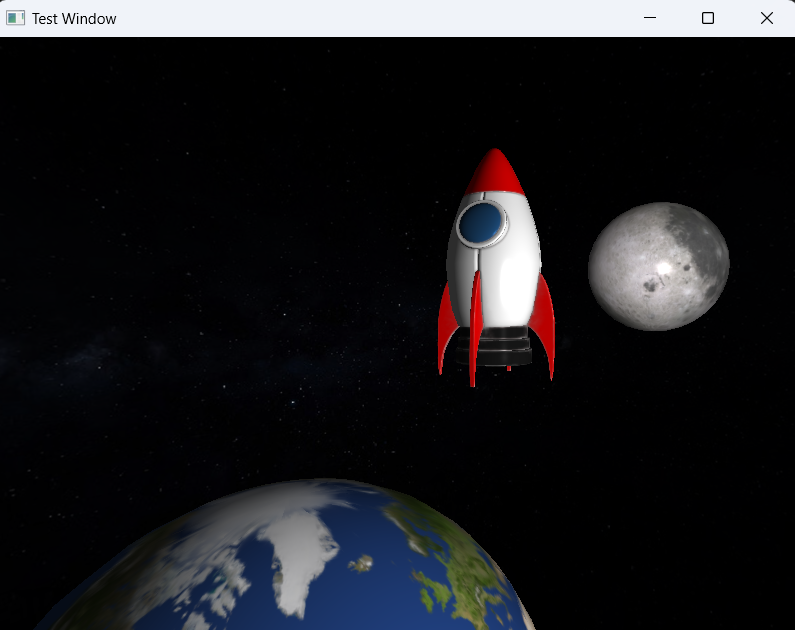

# Assignment 3: My Precious Moment  

## Description  
This project is part of our computer graphics assignment using Modern OpenGL. The goal was to create a themed image titled **"MY PRECIOUS MOMENT"** in an 800 x 600 resolution. The project includes lighting models and allows the use of external models and textures for rendering.  

### Key Requirements:  
- **Collaborative Work**: Worked in pairs.  
- **Creative Freedom**: Designed an image using vertices and applied textures and lighting.
  
---

## Preview  
Here is the final image we created:  

  

---

## References  
Our work utilized the following resources:  
1. **Rocket Model (OBJ and Texture)**:  
   [Toy Rocket Model - CGTrader](https://www.cgtrader.com/free-3d-models/space/spaceship/toy-rocket-4k)  
2. **Earth, Moon, and Space Models**: Created in Blender using spherical models.  
   - **Earth Texture**:  
     [8K Earth Day Map - Solar System Scope](https://www.solarsystemscope.com/textures/download/8k_earth_daymap.jpg)  
   - **Moon Texture**:  
     [8K Moon Map - Solar System Scope](https://www.solarsystemscope.com/textures/download/8k_moon.jpg)  
   - **Space Texture**:  
     [2K Stars Milky Way - Solar System Scope](https://www.solarsystemscope.com/textures/download/2k_stars_milky_way.jpg)  

---


## Instructions to Run  
1. Clone the repository:  
   ```bash
   git clone <repository-link>
   cd <repository-folder>
